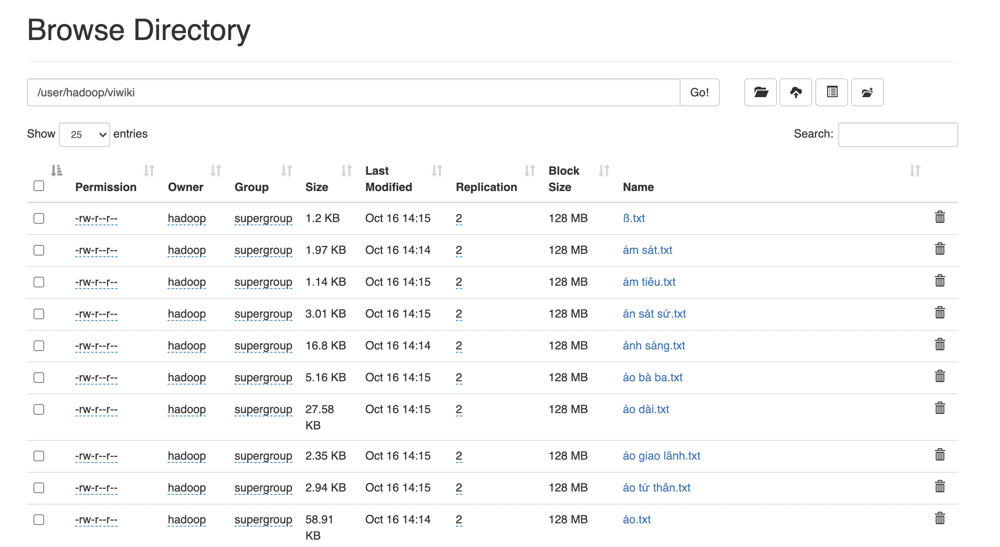

# LAB 01: CREATE HADOOP CLUSTER

## Introduction

In this work, I'm using **DigitalOcean** to create a hadoop cluster.
You can get 100$ for trial by using my referal link <https://m.do.co/c/57082dd20b0a>.
My hadoop site: <http://188.166.213.111:9870/>.

## Prerequisites

- Minimum 3 droplets in same LAN
- A non-root user with sudo privileges: <https://www.digitalocean.com/community/tutorials/how-to-create-a-sudo-user-on-ubuntu-quickstart>

## Setup

In each node:

- `git clone https://github.com/ducviet00/IT4931-Big-data-storage-and-processing.git`.
- Setup `hosts` file by adding private ip.
- Replace public ip of master node to `yarn.resourcemanager.hostname` property from `etc/yarn-site.xml`.
- Change number of replication in `dfs.replication` property from `etc/hdfs-site.xml`.
- Configure memory allocation by editing `etc/yarn-site.xml`, `etc/mapred-site.xml`, current configuration is for 1GB RAM nodes.
- Add the IP addresses of each of your worker nodes in `etc/workers`
- `sh IT4931-Big-data-storage-and-processing/LAB-01/install.sh`.
- Check if install succesfully by run `hadoop version`. If you see the following, you've successfully

    ```output
    Hadoop 3.3.1
    Source code repository https://github.com/apache/hadoop.git -r a3b9c37a397ad4188041dd80621bdeefc46885f2
    Compiled by ubuntu on 2021-06-15T05:13Z
    Compiled with protoc 3.7.1
    From source with checksum 88a4ddb2299aca054416d6b7f81ca55
    This command was run using /usr/local/hadoop/share/hadoop/common/hadoop-common-3.3.1.jar
    ```

In master node:

- Create SSH key and add public key into nodes:
  - `ssh-keygen -t ed25519`.
  - `cat ~/.ssh/id_ed25519.pub >> ~/.ssh/authorized_keys`.
  - `ssh -i ~/.ssh/id_ed25519.pub hadoop@node-worker1` and add key to other nodes.

## Run and monitor

In master node:

- `source ~/.zshrc` to use hadoop binary file directly
- Format HDFS `hdfs namenode -format`. The succesfully output will belike:

    ```output
    /************************************************************
    SHUTDOWN_MSG: Shutting down NameNode at hadoop/10.15.0.6
    ************************************************************/
    ```

- Start the Hadoop cluster `start-dfs.sh`. The succesfully output will appear:

    ```output
    Starting namenodes on [node-master]
    Starting datanodes
    node-worker2: datanode is running as process 19928.  Stop it first and ensure /tmp/hadoop-hadoop-datanode.pid file is empty before retry.
    node-worker1: datanode is running as process 19009.  Stop it first and ensure /tmp/hadoop-hadoop-datanode.pid file is empty before retry.
    Starting secondary namenodes
    ```

- To run YARN `start-yarn.sh`. The following output will appear :

    ```output
    Starting resourcemanager
    Starting nodemanagers
    ```

- Navigate to `http://YOUR-MASTER-NODE-PUBLIC-IP:9870` to go to hadoop overview site. If you have a firewall, be sure port 9870 is opened.

## Put data and wordcount example

- First, manually create your home directory. All other commands will use a path relative to this default home directory:
    `hdfs dfs -mkdir -p /user/hadoop`

- Let’s use wikipedia from [undertheseanlp](https://github.com/undertheseanlp/corpus.viwiki).

  - `git clone https://github.com/undertheseanlp/corpus.viwiki.git && cd corpus.viwiki`
  - `hdfs dfs -put viwiki viwiki`

- Now you can check your data by using web user interface:
    
    As you see, each text file has been replicated twice.

